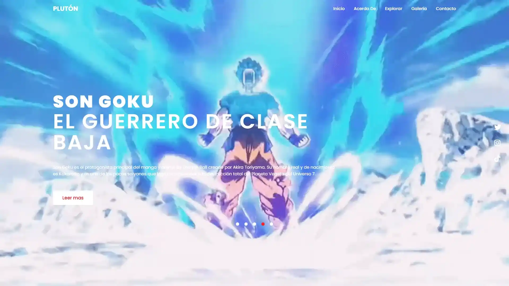
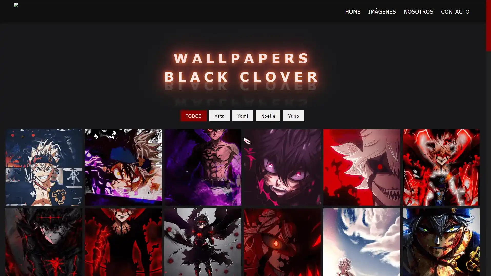
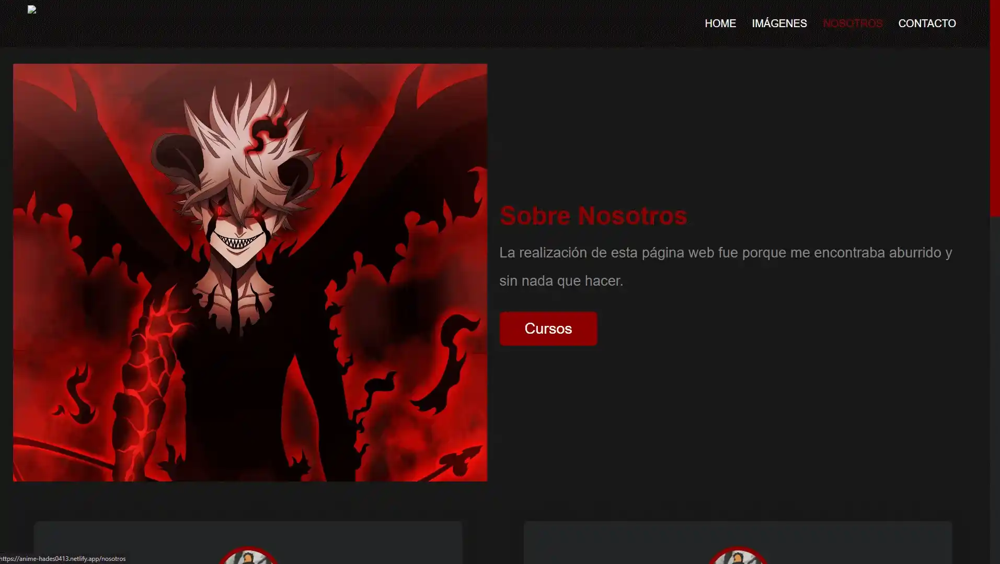
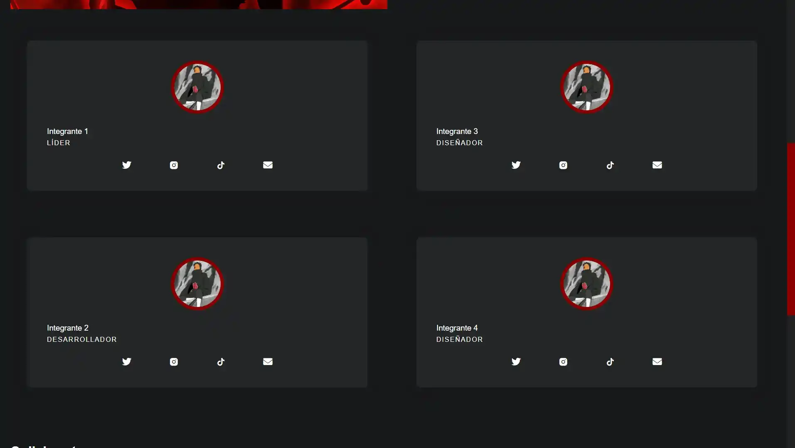
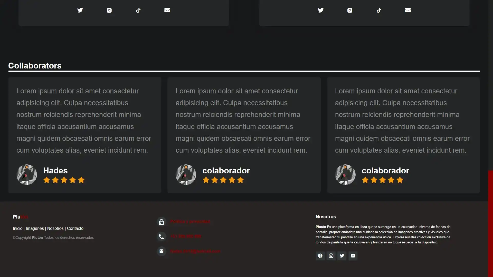
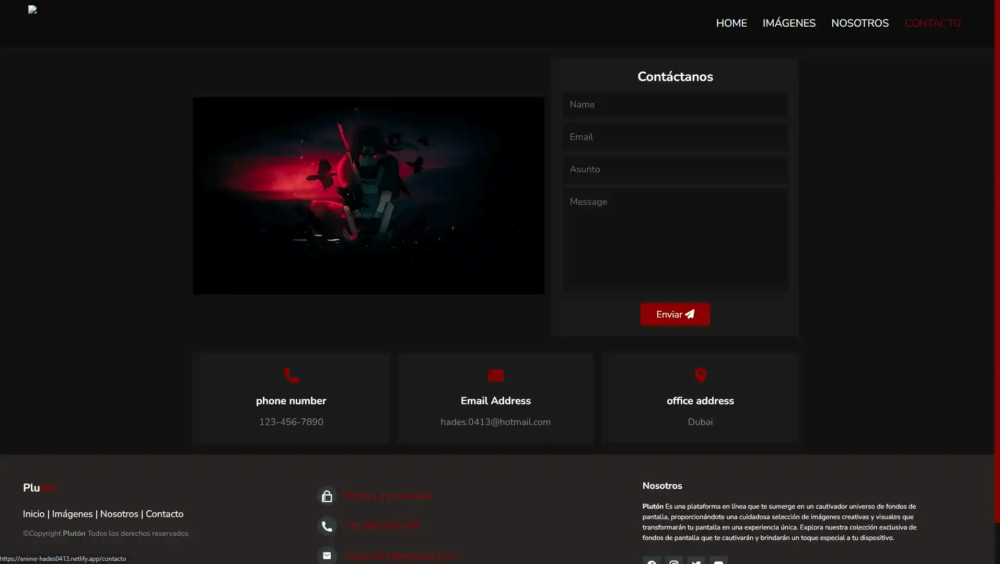

# Plutón/Anime

**Plutón/Anime**! es una plataforma web dedicada a los amantes del anime, donde pueden explorar y descargar fondos de pantalla (wallpapers) de sus personajes y series favoritas. El sitio ofrece una experiencia visual agradable y optimizada para disfrutar de imágenes de alta calidad, y tiene una interfaz sencilla con la posibilidad de interactuar con las imágenes de una forma dinámica.

## Índice

- [Descripción del Proyecto](#descripción-del-proyecto)
- [Tecnologías Utilizadas](#tecnologías-utilizadas)
- [Caracteristicas](#caracteristicas)
- [Estructura del Proyecto](#estructura-del-proyecto)
- [Funcionalidades](#funcionalidades)
- [Uso](#uso)
- [Contribuyentes](#contribuyentes)
- [Licencia](#licencia)
- [Imágenes y Videos](#imágenes-y-videos)

## Descripción del Proyecto

**Plutón/Anime** es un sitio web interactivo donde los usuarios pueden ver, filtrar y descargar imágenes de sus personajes de anime favoritos. El sitio cuenta con varias secciones, incluyendo una galería de imágenes y videos de personajes populares, y un formulario de contacto para consultas.

El sitio tiene una interfaz responsiva que se adapta tanto a dispositivos de escritorio como a móviles. Además, permite a los usuarios interactuar con las imágenes a través de un lightbox que les permite ver las imágenes en mayor tamaño y descargarlas.

## Tecnologías Utilizadas

Este proyecto utiliza las siguientes tecnologías y herramientas:

- **HTML5:** Estructura de la página.

- **CSS3:** Para el diseño y estilo visual de la página, incluyendo los efectos y animaciones.

- **JavaScript:** Para la interactividad del sitio, como el control de la galería de imágenes, el slider de videos y la funcionalidad de contacto.

- **EmailJS:** Para el envío de mensajes a través del formulario de contacto.

- **Font Awesome:** Íconos utilizados en la interfaz.

- **Google Fonts::** Fuentes personalizadas para la tipografía.

## Caracteristicas

Este proyecto incluye las siguientes características:

- **Galería de imágenes interactivas:** Los usuarios pueden ver y filtrar imágenes de anime por categoría y hacer clic en ellas para verlas en un tamaño más grande en un lightbox.

- **Funcionalidad de lightbox:** Al hacer clic en una imagen, se abre en un lightbox donde los usuarios pueden ver la imagen en detalle y descargarla.

- **Formulario de contacto:** Permite a los usuarios enviar mensajes directamente a los administradores del sitio.

- **Slider de videos de personajes:** Una sección de videos interactivos que muestra contenido relacionado con personajes populares de anime.

- **Menú de navegación accesible:** Un menú fácil de usar para navegar entre las secciones del sitio: Home, Imágenes, Nosotros y Contacto.

- **Redes sociales:** Enlaces a las redes sociales del creador del proyecto para facilitar el seguimiento y compartir el contenido.

## Estructura del Proyecto

La estructura del proyecto incluye los siguientes directorios principales:

```
└── 📁Anime
    └── 📁assets
        └── 📁img
            └── 1.jpg
            └── 📁black-clover
                └── 1.png
                └── 2.png
                └── 3.png
                └── ...
    └── 📁css
        └── contacto.css
        └── estilos.css
        └── imagenes.css
        └── nosotros.css
    └── 📁js
        └── contacto.js
        └── main.js
        └── scriptimg.js
    └── 📁public
        └── 📁img
            └── 📁README
                └── img4-2.webp
                └── img4-3.webp
                └── img4-4.webp
                └── img4-5.webp
    └── 1.jpg
    └── 1.mp4
    └── 2.mp4
    └── 3.mp4
    └── 4.mp4
    └── 5.mp4
    └── Baki.html
    └── Black_Clover.html
    └── close.png
    └── contacto.html
    └── DBS.html
    └── hades0.png
    └── index.html
    └── menu.png
    └── Naruto.html
    └── nosotros.html
    └── One_Piece.html
    └── README.md
```

## Funcionalidades

### 1. Galería de Imágenes

La página ofrece una galería interactiva donde los usuarios pueden ver y filtrar las imágenes de anime. Cada imagen puede ser vista en detalle a través de un lightbox que se activa al hacer clic en la imagen. En el lightbox, los usuarios pueden navegar entre las imágenes utilizando los botones de siguiente y anterior, y también tienen la opción de descargar la imagen.

### 2. Slider de Videos:

En la sección principal de la página, se muestran una serie de videos sobre personajes populares de anime como Itachi Uchiha, Liebe, Monkey D. Luffy, Son Goku y Baki Hanma. Los videos se reproducen automáticamente y se pueden navegar a través de botones de control.

### 3. Formulario de Contacto

Los usuarios pueden enviar mensajes a través del formulario de contacto. El formulario incluye campos para el nombre, correo electrónico, respuesta y mensaje. Los mensajes se envían mediante el servicio EmailJS, y se muestra una notificación de éxito o error dependiendo del resultado.

### 4. Menú de Navegación

La página principal muestra una cuadrícula de videos recomendados. Cada video incluye información sobre el título, el nombre del creador y la cantidad de vistas.

```bash
Home: Página principal con la galería de imágenes y videos.
```

```bash
Imágenes: Una página dedicada a mostrar todas las imágenes disponibles.
```

```bash
Nosotros: Información sobre el proyecto y sus objetivos.
```

```bash
Contacto: Página con el formulario para contactar con los administradores.
```

### 5. Redes Sociales

Se incluyen enlaces a las redes sociales del creador del proyecto (Twitter, Instagram y TikTok) para facilitar el seguimiento y el intercambio de contenido.

## Uso

### 1. Visualización

Para ver el sitio en tu navegador:

°Clona o descarga este repositorio en tu máquina local.
°Abre el archivo index.html en tu navegador web.

```bash
git clone https://github.com/Hades0413/Anime.git

cd Anime

open index.html


```

### 2. Personalización

Puedes personalizar los contenidos del sitio modificando los siguientes archivos:

```bash
Imágenes: Las imágenes están ubicadas en Anime/assets/img/.
```

```bash
Videos: Los archivos de video están ubicados en el directorio Anime/assets/.
```

```bash
Estilos: Los archivos CSS están en el directorio Anime/css/, siendo el archivo principal estilos.css.
```

```bash
JavaScript: El comportamiento interactivo del sitio está gestionado en js/main.js, donde puedes modificar el control de la galería, los videos y el formulario de contacto.
```

### 3. Envío de Mensajes

El formulario de contacto utiliza EmailJS para enviar los mensajes. Asegúrate de configurar adecuadamente tu cuenta de EmailJS para que funcione correctamente.

## Contribuyentes

```bash
Eduardo Miguel Jaime Gomero (Hades0413)
```

## Licencia

Este proyecto está bajo la Licencia MIT. Puedes usar, modificar y distribuir el código con fines personales o comerciales.

## Imágenes y Videos

### Imágenes:

A continuación, se muestran algunas imágenes del formulario de autenticación (AuthForm) y otras vistas relevantes:

1. 
2. 
3. 
4. 
5. 
6. 

Videos:
Demo del Proyecto:
Cómo ejecutar el Proyecto:

```

```
